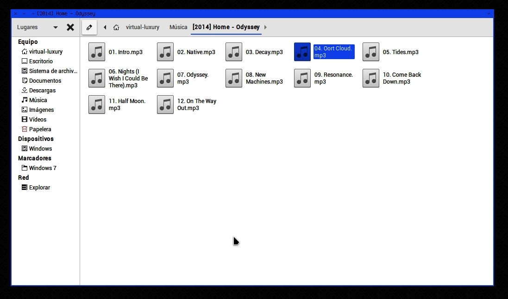

# SimpleBlue

_Tema minimalista azul para entornos de escritorio MATE._
_Modificado a partir de materia-gtk-theme._

## Como instalar

Copiar la carpeta `SimpleBlue` a la ubicación `/usr/share/themes` o a `~/.themes`

## Vista previa

